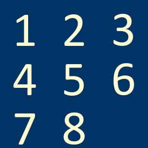
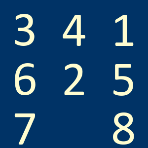

# EightTile Puzzle Solver

This project implements the 8-tile puzzle game, providing functionalities to shuffle the board, apply moves, and solve the puzzle using the A* algorithm. The solution also includes animation generation for the solving process.

## Features

- **EightTile Class**: Represents the 8-tile puzzle board with shuffling and move application capabilities.
- **BoardStates Class**: Manages board states and moves for the A* algorithm.
- **Solve8 Class**: Implements the A* algorithm to solve the 8-tile puzzle.
- **Animation Generation**: Generates an animation of the solution process.

## Installation

1. **Clone the repository**:
    ```sh
    git clone https://github.com/yourusername/eighttile-solver.git
    cd eighttile-solver
    ```

2. **Install required packages**:
    ```sh
    pip install numpy tabulate pillow imageio
    ```

## Usage

Here's an example of how to use the `EightTile` class to shuffle, solve the puzzle, and generate an animation of the solution.

```python
import time
from eighttile import EightTile, Solve8

# Initialize the board
t = EightTile()

# Shuffle the puzzle (replace 81 with any number of shuffles)
t.shuffle(81)

# Initial board
initial_board_img = Image.fromarray(t.BoardImage)
initial_board_img.save('initial_board.png')

# Solve the puzzle and get the sequence of moves
start_time = time.time()
p = Solve8()
solution_moves = p.Solve(t)
print(len(solution_moves))
time_duration = time.time() - start_time
print(time_duration)

# Solve the board and generate animation
frames = EightTile.GenerateAnimation(t, solution_moves, mName='puzzle_solution')

# Solved Board
solved_board_img = Image.fromarray(t.BoardImage)
solved_board_img.save('solved_board.png')

# Save the animation as a GIF file
imageio.mimsave('puzzle_solution.gif', frames, fps=15)

```
## Example
### Initial Board

### Solved Board

### Solution Animation
